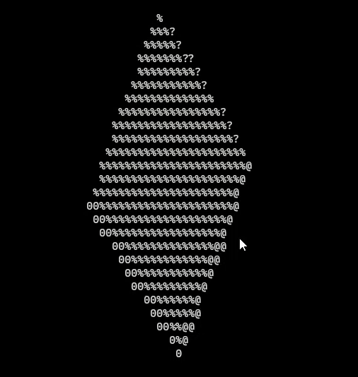

# 🎲 ASCII Spinning Cube in Rust

A terminal-based 3D spinning cube rendered in ASCII, written in Rust. Coded as a small re-write 
of the C-based version implemented in this [Youtube video](https://www.youtube.com/watch?v=p09i_hoFdd0)

 

*(Click GIF if it doesn’t animate)*  

## Features
- Real-time rotation with adjustable speed  
- Pure ASCII output (no external dependencies)  
- Customizable cube size and perspective  

## Quick Start
```bash
git clone https://github.com/henrique-azank/rust-spinning-ascii-cube.git
cd rust-spinning-ascii-cube
cargo run --release
```

## Build
Requires Rust 1.70+:
```bash
cargo build --release
```

## How It Works
Uses ANSI escape codes (`\x1b[2J`) for screen clearing and 3D projection math to render frames.

---

🛠️ **Contribute**: PRs welcome!  
⭐ **Star this repo** if you like it!
